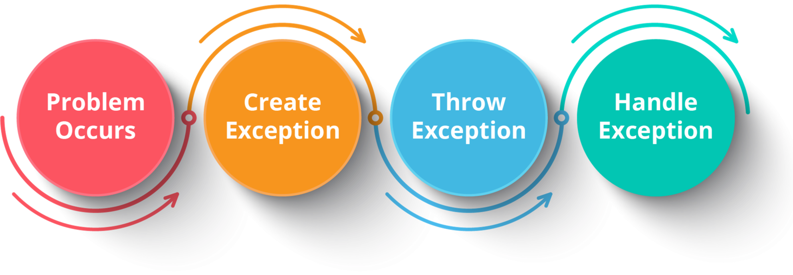

# 
Exception Handling

An exception is a problem that arises during the execution of a program.

<B>Reasons :</B>

* A user has entered an invalid data
* File not found
* A network connection has been lost in the middle of communications
* The JVM has run out of a memory

If an exception is not handled, it may lead to a system failure. 

<B>What happens if exceptions are not handled?</B>

When an exception occurs, and if you don’t handle it, the program will terminate abruptly (the piece of code after the line causing the exception will not get executed).

<B>How JVM handles Exception?</B>

* When Exception occurs -> method creates an object called Exceptional object and hands over to run-time system.

* This exceptional object contains name and description of exception and current state of program where the exception has occurred.

* Creating exception object and handling it to the run-time is called throwing and exception.  

### Important Points:

* A finally block must be associated with a try block, you cannot use finally without a try block. You should place those statements in this block that must be executed always.

* Finally block is optional, however if you place a finally block then it will always run after the execution of try block.

* In normal case when there is no exception in try block then the finally block is executed after try block. However if an exception occurs then the catch block is executed before finally block.

* An exception in the finally block, behaves exactly like any other exception.

* The statements present in the finally block execute even if the try block contains control transfer statements like return, break or continue.

## Programs
1. Implement a simple calculator program that allows the user to specify an operator and up to two operands (arguments / parameters).
Valid expressions consist of a sequence of one, two or three tokens (each token is separated from the preceding token by one or more spaces), and may take on one of the following forms:
* 1 token: [quit]. The program responds by exiting
* 2 tokens: [UOP N], where N is an integer and UOP is a unary operator (“-”). The program responds by displaying the negative of the given integer.
* 3 tokens: [N1 BOP N2], where N1 and N2 are integers and BOP is a binary

operator (“+” or “/” only). The program responds by displaying the result of applying the designated operator to the two arguments.
A finally block : displaying “task completed”.

### Sample Input:
    4 + 2
    The result is : 6
    task completed

    42+7
    Illegal input : Illegal Argument
    task completed

    4 / 2
    The result is : 2
    task completed
    
    foo + 2
    Illegal input : Illegal Argument
    task completed

    42 ^ 3
    Illegal input : Illegal Operator
    task completed

    
    Illegal input : Illegal Argument
    task completed

    32 ^ baz
    Illegal input : Illegal Argument
    task completed

    foobar ^ 3
    Illegal input : Illegal Argument
    task completed

    4 / 0
    Tried to divide by zero
    task completed

    -4
    Illegal input : Illegal Argument
    task completed

    - 4
    The result is : -4
    task completed

    1 + 2 + 3
    Illegal input : Illegal Token Length
    task completed

    45+ 2
    Illegal input : Illegal Operator
    task completed
    
    45 +2
    Illegal input : Illegal Operator
    task completed

    QUIT
    Quitting
    task completed

Exceptions:
1. QuitException: thrown when the user inputs "quit" to end the program (case
insensitive).
2. DivideByZeroException: thrown when the program attempts to divide by 0.
3. IllegalInputException: thrown when the input does not match with a format
that we expect.

    (a) “Illegal Token Length”: when the number of tokens is less than 1 or greater than 3.

    (b) “Illegal Argument": when a token does not match the type of token expected in its position. For example, in the input "1 + a", "a" is an illegal argument, as it is not an int.

    (c) “Illegal Operator": when a token in an operator position is not supported by the program. The program only accepts the “+” and “/” operators for binary operations. So, “1 * 2” would yield this error.

--------
2. Using the concept of inner classes in JAVA, implement following operations.
Accept two values. Find Sum, Difference, Quotient, Reminder, Product and display it. Include exceptions at needed places.

### Sample Input1:

    Input1 = 6
    Input2 = 4

    Output: Sum = 10
    Difference = 2
    Product = 24    
    Quotient = 1
    Reminder = 2

### Sample Input2:

    Input1 = 9
    Input2 = 0
    
    Output: Sum = 9
    Difference = 9
    Product = 0
    Quotient: Division by Zero not possible
    Reminder: Division by Zero not possible

### Sample Input3:

    Input1=sp
    Input2=3
    
    Output: Invalid Argument Exception

### 
Naresh Kumar B 

